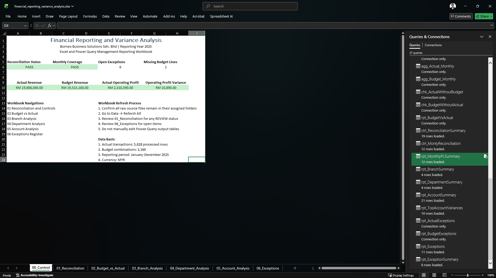
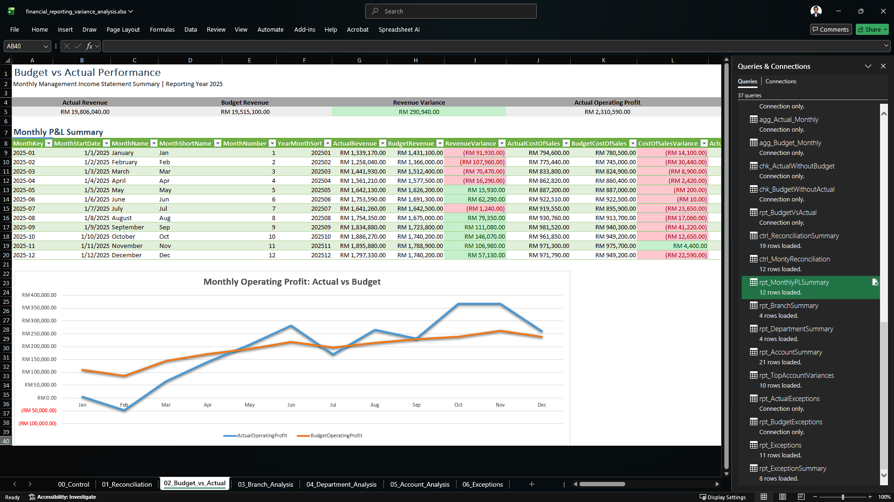

# Financial Reporting and Variance Analysis

## Project Status

🚧 **In Progress**

**Stage 1: Excel & Power Query ✅ Complete**

The Excel and Power Query reporting workflow is complete. The next stage will focus on SQL validation and investigation, followed by Power BI modelling and dashboard development.

## Project Overview

This project simulates a financial reporting and variance analysis process for a fictional multi-branch company.

The objective is to compare actual financial performance against budget, identify significant variances, investigate data-quality and reporting exceptions, and translate the results into clear management insights.

The project demonstrates how Excel, Power Query, SQL and Power BI can be integrated across a practical finance reporting workflow.

## Stage 1 Preview

Stage 1 established the Excel and Power Query reporting foundation, including data transformation, reconciliation controls, Budget vs Actual reporting and exception monitoring.

### Management Control Overview

The control page provides a high-level view of reporting status, annual financial performance, open exceptions and workbook navigation.



### Budget vs Actual Performance

The monthly management reporting view compares actual and budget performance across revenue, costs and operating profit, supported by variance analysis and monthly trend reporting.



## Business Objective

Management requires a reliable monthly reporting process to understand:

* whether revenue and expenses are performing according to budget
* which branches or departments are contributing to major variances
* which accounts require further investigation
* how financial performance changes across reporting periods
* whether reporting data is complete and internally reconciled
* what management actions may be required based on the results

## Stage 1: Excel & Power Query ✅

The first stage established the complete financial reporting and data-control foundation.

### Data Preparation and Transformation

* Consolidated 12 monthly transaction files using Power Query
* Combined 5,829 raw financial transactions
* Created separate raw, clean and processed data layers
* Standardised reporting keys and text fields
* Validated branch, department, account, vendor and reporting-period references
* Identified duplicate transactions, missing values, invalid account codes and unusual transactions
* Produced 5,828 reporting-ready actual transactions after resolving one confirmed duplicate

### Budget Processing

* Imported and validated the 2025 monthly budget
* Verified 2,159 original budget records
* Identified one missing budget combination
* Created a complete 2,160-line reporting budget structure
* Preserved the missing source line as a documented reporting exception

### Reconciliation and Controls

* Built 19 reconciliation and reporting control checks
* Reconciled raw, clean, processed and aggregated financial totals
* Confirmed actual and budget reporting-key coverage
* Validated monthly variance logic
* Created monthly reporting coverage controls
* Confirmed all reconciliation controls passed

### Financial Analysis

Developed Excel reporting outputs for:

* monthly Budget vs Actual performance
* revenue variance
* Cost of Sales variance
* gross profit variance
* operating expense variance
* operating profit variance
* operating margin analysis
* branch performance
* department performance
* account-level variance analysis
* Top 10 account variances
* data-quality and management exceptions

### Excel Reporting Workbook

The completed workbook contains:

```text
00_Control
01_Reconciliation
02_Budget_vs_Actual
03_Branch_Analysis
04_Department_Analysis
05_Account_Analysis
06_Exceptions
````

The `00_Control` worksheet provides a management overview of reporting status, annual financial performance, open exceptions and workbook navigation.

## Analysis Scope

The project focuses on:

* budget versus actual performance
* revenue and expense variance
* favourable and unfavourable variance classification
* monthly financial trends
* gross profit and operating profit performance
* operating margin analysis
* branch and department performance
* account-level variance investigation
* significant and unusual transactions
* data-quality and reporting exceptions
* reconciliation and reporting controls
* management commentary and recommendations

## Project Workflow

```text
Raw Financial Data
        ↓
Power Query Consolidation
        ↓
Data Cleaning and Validation
        ↓
Processed Actual and Budget Data
        ↓
Reconciliation and Control Checks
        ↓
Excel Financial Reporting
        ↓
SQL Validation and Investigation
        ↓
Power BI Data Model
        ↓
Interactive Management Dashboard
        ↓
Management Insights and Recommendations
```

## Tools

* **Excel** — financial reporting, reconciliation, variance analysis and management outputs
* **Power Query** — data consolidation, cleaning, transformation and validation
* **SQL** — independent validation, aggregation and exception investigation
* **Power BI** — data modelling, financial measures and dashboard reporting
* **GitHub** — project documentation and portfolio presentation

## Repository Structure

```text
financial-reporting-variance-analysis/
├── README.md
├── data/
│   ├── raw/
│   └── processed/
├── excel/
├── power-query/
├── sql/
├── powerbi/
├── images/
└── documentation/
```

## Project Deliverables

### Completed

* fictional financial transaction dataset
* annual budget dataset
* account, branch, department, vendor and month reference tables
* Excel financial reporting workbook
* Power Query transformation workflow
* data validation and exception controls
* Budget vs Actual analysis
* branch, department and account analysis
* reconciliation and control reporting
* management exception register

### In Progress / Upcoming

* SQL validation and investigation queries
* Power BI data model
* interactive Power BI dashboard
* dashboard screenshots
* management insight summary
* final project documentation
* final GitHub portfolio presentation

## Project Roadmap

* [x] Create the GitHub repository and initial README
* [x] Define the business scenario and dataset structure
* [x] Generate the source datasets
* [x] Prepare the Excel analysis workbook
* [x] Build the Power Query transformation workflow
* [x] Clean and validate actual transaction data
* [x] Validate and process the annual budget
* [x] Build reconciliation and reporting controls
* [x] Build Budget vs Actual analysis
* [x] Build branch, department and account analysis
* [x] Create the exception register
* [x] Complete Stage 1: Excel & Power Query
* [ ] Perform Stage 2: SQL validation and investigation
* [ ] Build Stage 3: Power BI data model
* [ ] Create the financial reporting dashboard
* [ ] Document key insights and recommendations
* [ ] Finalise screenshots and project documentation
* [ ] Finalise the GitHub portfolio presentation

## Current Project Progress

```text
Stage 1 — Excel & Power Query                 ✅ Complete
Stage 2 — SQL Validation & Investigation      ⬜ Next
Stage 3 — Power BI Model & Dashboard          ⬜ Planned
Stage 4 — Documentation & Portfolio Packaging 🚧 In Progress
```

## Key Stage 1 Reporting Figures

```text
Raw Actual Transactions:        5,829
Processed Actual Transactions:  5,828
Budget Reporting Combinations:  2,160
Reconciliation Controls:        19
Reporting Period:               January to December 2025
Currency:                       Malaysian Ringgit (RM)
```

Annual reporting totals:

```text
Actual Revenue:            RM19,806,040
Budget Revenue:            RM19,515,100
Revenue Variance:          RM290,940 Favourable

Actual Operating Profit:   RM2,310,590
Budget Operating Profit:   RM2,299,700
Operating Profit Variance: RM10,890 Favourable
```

## Learning Outcomes

Through this project, I am strengthening my ability to:

* understand practical financial reporting requirements
* structure financial data for repeatable reporting
* clean and validate data using Power Query
* reconcile financial figures across reporting stages
* calculate and interpret Budget vs Actual variances
* investigate data-quality and financial-reporting exceptions
* analyse performance across branches, departments and accounts
* build management-focused financial reports
* validate reporting outputs across Excel, SQL and Power BI
* communicate financial findings through clear business reporting

## Data Disclaimer

All company names, transactions, budgets and financial figures used in this project are fictional and created solely for learning and portfolio purposes.

The project does not contain confidential information from any real organisation.

## Author

**Darrell Gayok Insor**

Finance graduate developing practical skills in financial analysis, financial reporting, business intelligence and data-driven decision support.
