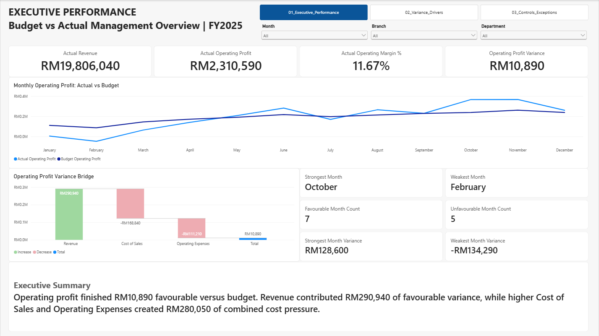
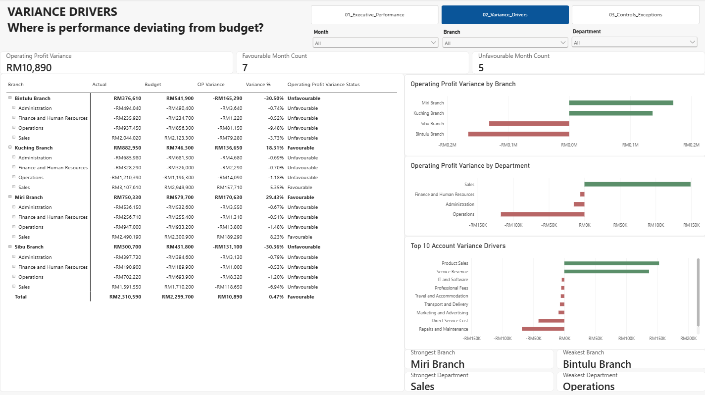
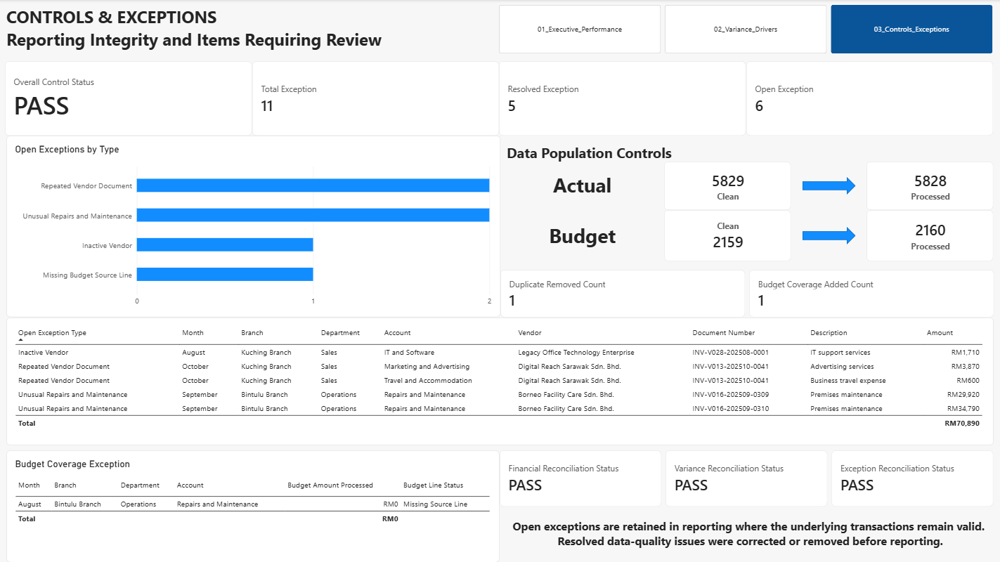

# Financial Reporting & Variance Analysis

An end to end finance analytics project demonstrating how **Excel, Power Query, SQL and Power BI** can work together to support management reporting, Budget vs Actual analysis, financial reconciliation and variance investigation.

The project uses synthetic financial data for a fictional multi branch company and follows the reporting process from raw transactions through validation, analysis and management dashboarding.

---

## Project Overview

The project represents **Borneo Business Solutions Sdn. Bhd.**, operating across Kuching, Sibu, Bintulu and Miri during FY2025.

The objective was to build a controlled financial reporting workflow capable of:

* Cleaning and validating financial data
* Reconciling Actual and Budget reporting populations
* Producing management income statement reporting
* Analysing favourable and unfavourable variances
* Investigating performance by month, branch, department and account
* Identifying data quality and reporting exceptions
* Converting validated results into an interactive management dashboard

---

## End to End Workflow

```text
Raw Financial Data
        ↓
Power Query
Clean, Transform & Validate
        ↓
Excel
Management Reporting & Reconciliation
        ↓
SQLite / SQL
Independent Validation & Investigation
        ↓
Power BI
Interactive Management Analysis
```

Each tool serves a different purpose in the reporting workflow rather than repeating the same analysis in another interface.

---

## Dashboard Preview

### Executive Performance

Provides a high level view of Actual vs Budget performance, monthly Operating Profit trends, variance drivers and management commentary.



### Variance Drivers

Drills from company performance into branch, department and account level variance drivers.



### Controls & Exceptions

Monitors reporting integrity, data population controls and transactions requiring management review.



---

## Key Financial Results

| Metric | Actual | Budget | Variance |
|---|---:|---:|---:|
| Revenue | RM19,806,040 | RM19,515,100 | RM290,940 F |
| Cost of Sales | RM10,813,140 | RM10,644,300 | RM168,840 U |
| Gross Profit | RM8,992,900 | RM8,870,800 | RM122,100 F |
| Operating Expenses | RM6,682,310 | RM6,571,100 | RM111,210 U |
| Operating Profit | RM2,310,590 | RM2,299,700 | **RM10,890 F** |

**Actual Operating Margin: 11.67%**

Revenue finished above budget, but most of the upside was offset by higher Cost of Sales and Operating Expenses. As a result, Operating Profit finished only **RM10,890 favourable** overall.

---

## Key Analytical Findings

* **7 months** were favourable and **5 months** were unfavourable
* **October** recorded the strongest Operating Profit variance at **RM128,600 favourable**
* **February** recorded the weakest variance at **RM134,290 unfavourable**
* **Miri** was the strongest branch by Operating Profit variance
* **Bintulu** was the weakest branch
* **Sales** was the strongest department
* **Operations** was the weakest department
* Account level analysis identified both favourable revenue drivers and significant cost pressures beneath the company result

The analysis demonstrates why a relatively small annual variance can still contain meaningful offsetting movements underneath it.

---

## Reporting Controls

The project includes controlled data quality and reporting exceptions to demonstrate validation and investigation techniques.

| Control | Result |
|---|---:|
| Raw Actual Transactions | 5,829 |
| Processed Actual Transactions | 5,828 |
| Source Budget Rows | 2,159 |
| Processed Budget Rows | 2,160 |
| Total Exceptions | 11 |
| Resolved Exceptions | 5 |
| Open Exceptions | 6 |
| Final SQL Controls | 14 PASS |
| Power BI Overall Control Status | PASS |

Open exceptions include inactive vendor activity, unusual Repairs & Maintenance transactions, repeated vendor documents and one missing budget source line.

Valid transactions are retained in reporting where appropriate while still being surfaced for management review.

---

## Tools Used

| Tool | Application |
|---|---|
| Excel | Management reporting, reconciliation and financial analysis |
| Power Query | Data cleaning, transformation and validation |
| SQLite / SQL | Independent financial validation and investigation |
| Power BI | Interactive management reporting and variance analysis |
| GitHub | Documentation and portfolio presentation |

---

## Technical Documentation

Detailed documentation is separated by workflow stage:

* [Power Query Transformation](power-query/README.md)
* [SQL Validation & Investigation](sql/README.md)
* [Power BI Management Dashboard](powerbi/README.md)

This keeps the main project page concise while preserving the technical work for deeper review.

---

## Repository Structure

```text
financial-reporting-variance-analysis/
│
├── data/
│   ├── raw/
│   └── processed/
│
├── excel/
│   └── financial_reporting_variance_analysis.xlsx
│
├── power-query/
│   └── README.md
│
├── sql/
│   ├── queries/
│   └── README.md
│
├── powerbi/
│   ├── financial_reporting_variance_analysis.pbix
│   └── README.md
│
├── images/
│   ├── stage1_00_control.png
│   ├── stage1_02_budget_vs_actual.png
│   ├── stage3_01_executive_performance.png
│   ├── stage3_02_variance_drivers.png
│   └── stage3_03_controls_exceptions.png
│
└── README.md
```

---

## Project Status

| Stage | Scope | Status |
|---|---|---|
| Stage 1 | Excel + Power Query | ✅ Complete |
| Stage 2 | SQL Validation & Investigation | ✅ Complete |
| Stage 3 | Power BI Management Dashboard | ✅ Complete |
| Stage 4 | Final Portfolio Packaging | 🔄 In Progress |

---

## What This Project Demonstrates

The project demonstrates practical application of:

* Financial reporting and Budget vs Actual analysis
* Reconciliation and control design
* Power Query transformation
* SQL validation and investigation
* Dimensional modelling
* DAX measures and variance logic
* Management dashboard design
* Cross tool reconciliation
* Translating financial data into management insight

The workflow follows:

```text
Data
  ↓
Control
  ↓
Reporting
  ↓
Variance
  ↓
Driver
  ↓
Management Insight
```

---

## Disclaimer

This project uses fictional company information and synthetic financial data created solely for portfolio and learning purposes.

No confidential company, employer or client information is used.

---

## Author

**Darrell Gayok Insor**

Finance graduate focused on financial analysis, financial reporting and business intelligence using Excel, Power Query, SQL and Power BI.
